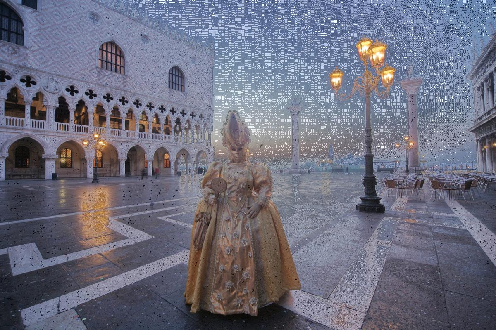
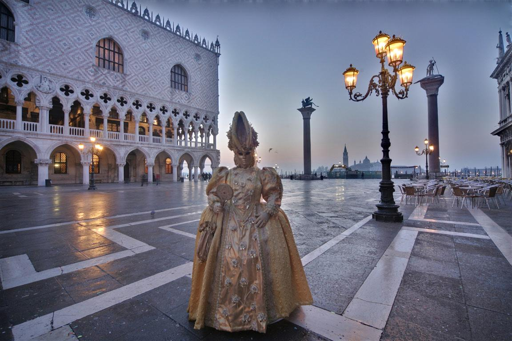

# Exposure Fusion
Exposure Fusion Technique
This code implements the Exposure Fusion, a Low-Dynamic-Range technique. It blends multi-exposure sequence of photo into a high-quality image, and is guided by measurement as Contrast, Saturation and Well-exposedness.

You can find the Research paper where the algorithm comes from [here](https://github.com/Rachine/ExposureFusion/blob/master/exposure_fusion.pdf) [1]

This code used python 2.7 and the packages Numpy and SciPy.

Here some multi-exposure sequence of photo used:

  

Here the result with the Naive implementation:

Here the result with the Exposure Fusion algorithm with the Laplacian Pyramid:

### Usage

To test the code with your own images, put them in a new folder under the folder _image\_set_ and edit the text file _list\_images.txt_ by putting the names of your images.
Then run _main.py_ with the desired arguments. You can see all the possible arguments by running: `python main.py -h`

### Authors
 - Chaïmaa Kadaoui
 - [Rachid Riad](https://rachine.github.io/)

### References
[1]: Exposure Fusion: A Simple and Practical Alternative to High Dynamic Range Photography
Mertens, T.; Kautz, J.; Van Reeth, F.

[2]: P. Burt and T. Adelson. The Laplacian Pyramid as a Com-
pact Image Code. IEEE Transactions on Communication,
COM-31:532–540, 1983.
